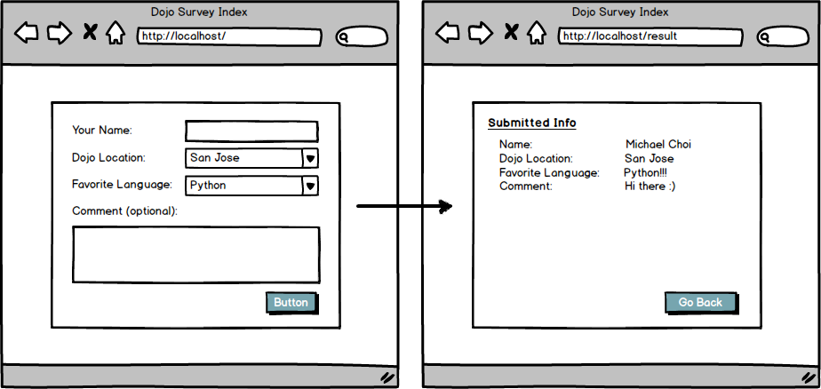

# Dojo Survey

## Coding Dojo Core Assignment 07.11.2022

 

Build a new Flask application that accepts a form submission and presents the submitted data on a results page.

The goal is to help you get familiar with sending POST requests through a form and displaying that information. Consider the below example as a guide.

When you build this, please make sure that your program meets the following criteria:

* http://localhost:5000 - have this display a nice looking HTML form.  The form should be submitted to '/process'
* Save form data into session.
* http://localhost:5000/result - have this display a html with the information that was submitted by POST
Don't forget that any inputs we want to be able to access from the form submission need to have a name!

It's always a good idea to print request.form to see if the form is delivering all the information you need in your routing method.

 

**Step:**
* Create a new Flask application
* Have the root route ("/") show a page with the form
* Have the "/result" route display the information from the form on a new HTML page
* Put the form data into session
